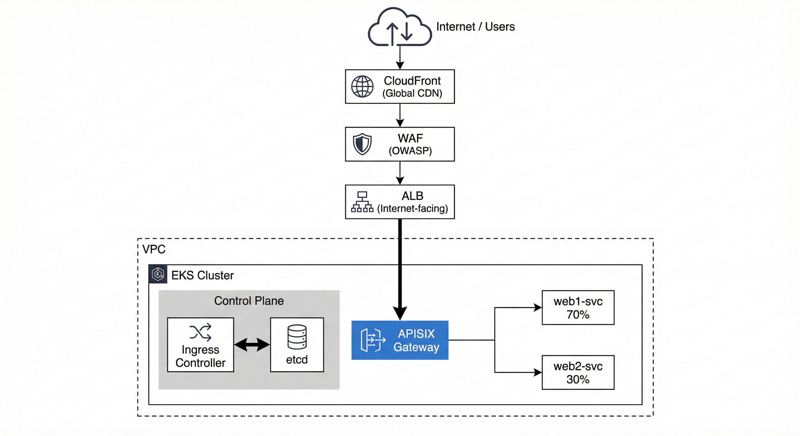

# poc-apisix

APISIX API gateway with etcd, two nginx upstreams, Prometheus, and Zipkin.

## Prerequisites

- Docker and Docker Compose

## Quick start

**arm64 (Apple Silicon):**

```bash
docker compose -f docker-compose-arm64.yml up -d
```

**amd64 (x86):**

```bash
docker compose up -d
```

## Services

| Service    | Port  | Description              |
|-----------|-------|--------------------------|
| APISIX    | 9080, 9180, 9091, 9443 | API gateway              |
| etcd      | 2379  | Config store             |
| web1      | 9081  | Upstream nginx           |
| web2      | 9082  | Upstream nginx           |
| Prometheus| 9090  | Metrics (arm64 stack)    |
| Zipkin    | 9411  | Tracing (arm64 stack)    |
| Grafana   | 3000  | Dashboards (arm64 stack) |

## Config

| Path | Purpose |
|------|---------|
| `apisix_conf/config.yaml` | APISIX (etcd, admin keys) |
| `upstream/web1.conf`, `web2.conf` | nginx upstreams |
| `prometheus_conf/prometheus.yml` | Prometheus scrape (APISIX 9091) |

## Docs

| Doc | Content |
|-----|---------|
| [docs/EXPOSE_API.md](docs/EXPOSE_API.md) | Upstream, route, proxy to httpbin |
| [docs/PROTECT_API.md](docs/PROTECT_API.md) | Rate limit (limit-count) |
| [docs/OBSERVE_API.md](docs/OBSERVE_API.md) | Logs, Prometheus metrics, Zipkin tracing |
| [docs/GRAFANA.md](docs/GRAFANA.md) | Grafana login, first chart, dashboards |
| [docs/HEALTH_CHECK.md](docs/HEALTH_CHECK.md) | Upstream health check (active + passive), Control API |

## Full stack (amd64)

`docker-compose.yml` adds Prometheus (9090) and Grafana (3000). Needs `prometheus_conf/` and `grafana_conf/` in place.

## Deploy to Kubernetes (Production)

For production-grade deployment on AWS EKS with CloudFront + WAF + ALB, see:

- [k8s/docs/TERRAFORM_SETUP.md](k8s/docs/TERRAFORM_SETUP.md) - Deploy Terraform infrastructure (VPC, EKS, CloudFront, WAF)
- [k8s/docs/K8S_DEPLOYMENT.md](k8s/docs/K8S_DEPLOYMENT.md) - Deploy APISIX and applications to Kubernetes
- [k8s/docs/SECURITY_LAYERS.md](k8s/docs/SECURITY_LAYERS.md) - Security architecture overview

### Architecture



```
Internet -> CloudFront -> WAF -> ALB -> APISIX -> Apps
```

### Quick Start

```bash
# 1. Deploy Terraform infrastructure
cd terraform
./scripts/apply.sh

# 2. Update kubeconfig
aws eks update-kubeconfig --name apisix-cluster --region ap-southeast-1

# 3. Deploy K8s resources
cd k8s
./scripts/deploy.sh

# 4. Test routing
curl http://<ALB-DNS-NAME-or-CLOUDFRONT-URL>/web
```

### Features

- **Terraform modules**: Reusable, testable infrastructure as code
- **VPC with public/private subnets**: Standard production architecture
- **EKS managed node groups**: AWS-managed Kubernetes nodes
- **ALB (internet-facing)**: CloudFront origin; WAF in front
- **CloudFront + WAF**: Global CDN + OWASP protection + rate limiting
- **APISIX canary deployments**: 70:30 traffic split for testing
- **Health checks**: Active + passive health monitoring
- **Validation scripts**: Dry-run testing with `terraform validate`, `kubectl --dry-run`

### Cost Estimate

~$200-250/month for full production stack (light traffic).

See [k8s/docs/TERRAFORM_SETUP.md](k8s/docs/TERRAFORM_SETUP.md) for detailed cost breakdown.
